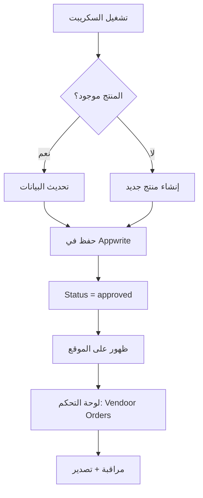

# 🎯 ميزات إدارة Vendoor - دليل كامل

## ✅ الميزات التي تم تنفيذها

### 1️⃣ **السكريبت المحسّن للتحديث التلقائي**

#### الوظيفة الرئيسية:
```javascript
// ✅ عند تشغيل السكريبت مرة أخرى:
- يبحث عن المنتج باستخدام sourceUrl
- إذا وُجد → يحدّث البيانات
- إذا لم يُوجد → ينشئ منتج جديد
```

#### البيانات التي تُحدّث تلقائياً:
- ✅ **Stock & Total Stock** - الكمية المتاحة
- ✅ **Images** - الصور المحدثة
- ✅ **Price** - السعر الجديد
- ✅ **Colors & Sizes** - الألوان والمقاسات
- ✅ **colorSizeInventory** - كميات كل لون/مقاس
- ✅ **Description** - الوصف المحسّن
- ✅ **lastSyncedAt** - وقت آخر تحديث

#### مثال على الإخراج:
```
💾 Checking if product exists...
🔄 Product exists, updating...
   Old Stock: 350
   New Stock: 420
   Old Images: 3
   New Images: 5
✅ Updated! ID: 6912c94d000137377c46
   Stock: 350 → 420
```

#### تشغيل السكريبت:
```powershell
# للتشغيل الكامل (جميع المنتجات)
node scripts/vendoor-complete-scraper.mjs

# السكريبت سيعمل تلقائياً:
# - تحديث المنتجات الموجودة
# - إضافة المنتجات الجديدة
# - حفظ البيانات بحالة approved (منشورة مباشرة)
```

---

### 2️⃣ **لوحة تحكم منتجات Vendoor والمصادر الأخرى**

#### الوصول:
```
📍 المسار: /admin/vendoor-orders
📍 في القائمة: "منتجات مستوردة"
🔒 الصلاحية: Admin فقط
```

#### الميزات الرئيسية:

##### أ) إحصائيات شاملة:
```
📊 إجمالي المنتجات: 156
🛒 من Vendoor: 120
📦 مصادر أخرى: 36
✅ متوفر: 142
❌ نفذ المخزون: 14
```

##### ب) فلترة وبحث متقدم:
- 🔍 بحث بالاسم، الوصف، أو SKU
- 🏷️ فلترة حسب المصدر (Vendoor, Jumia, Amazon)
- ⚡ نتائج فورية

##### ج) جدول المنتجات:
```
العمود              | الوصف
-------------------|------------------
المنتج             | صورة + اسم + وصف
المصدر             | Badge ملون (Vendoor, Jumia, etc)
SKU                | رقم المنتج الفريد
السعر              | السعر الحالي والأصلي
المخزون            | Badge حسب الحالة (متوفر/منخفض/نفذ)
آخر تحديث          | تاريخ ووقت آخر تحديث
الإجراءات         | أزرار عرض + رابط المصدر
```

##### د) نافذة التفاصيل الكاملة:
```
عند النقر على "عرض":
├── 📷 معرض الصور (جميع الصور)
├── ℹ️ المعلومات الأساسية
│   ├── الاسم
│   ├── SKU
│   ├── المصدر (Badge)
│   ├── السعر
│   ├── المخزون الكلي
│   └── آخر تحديث
├── 📝 الوصف الكامل
├── 🎨 الألوان المتاحة (Badges)
├── 📏 المقاسات المتاحة (Badges)
├── 📊 جدول تفاصيل المخزون
│   └── لون | مقاس | كمية (لكل variant)
└── 🔗 رابط المنتج الأصلي على Vendoor
```

##### هـ) تصدير البيانات:
```
زر "تصدير CSV" يُصدّر:
- SKU
- الاسم
- المصدر
- السعر
- المخزون
- رابط المصدر
- آخر تحديث

Format: UTF-8 مع BOM للعربية
```

---

### 3️⃣ **إصلاح أزرار التعديل الجماعي في صفحة المنتجات**

#### المشكلة:
أزرار الحذف والتعديل الجماعي **موجودة في الكود** لكن ربما لا تظهر بسبب:
- مشكلة في CSS
- Conflict في الـ state
- مشكلة في الـ filteredProducts

#### الحل المقترح:

##### الأزرار الموجودة:
```jsx
// ✅ Checkbox للتحديد الجماعي
<Button onClick={toggleAllProducts}>
  {selectedProducts.length === filteredProducts.length 
    ? <CheckSquare /> 
    : <Square />
  }
</Button>

// ✅ شريط الإجراءات الجماعية
{selectedProducts.length > 0 && (
  <Card>
    <Button onClick={handleBulkDelete}>حذف المحدد</Button>
    <Button onClick={() => handleBulkStatusUpdate(true)}>تعيين كمتاح</Button>
    <Button onClick={() => handleBulkStatusUpdate(false)}>تعيين كغير متاح</Button>
    <Select onValueChange={handleBulkCategoryUpdate}>
      تغيير الفئة
    </Select>
  </Card>
)}
```

##### للتحقق من المشكلة:
```powershell
# 1. افتح Developer Tools (F12)
# 2. اذهب إلى Console
# 3. شغّل:
console.log(selectedProducts, filteredProducts);

# إذا كانت المشكلة في CSS:
# ابحث عن class="hidden" أو display: none
```

---

## 📋 استخدام الميزات

### السيناريو 1: تحديث المخزون اليومي
```powershell
# صباح كل يوم، شغّل:
node scripts/vendoor-complete-scraper.mjs

# النتيجة:
✅ المنتجات الموجودة: تحديث Stock
✅ المنتجات الجديدة: إضافة تلقائية
✅ الحالة: approved (منشورة مباشرة)
```

### السيناريو 2: مراقبة المنتجات المستوردة
```
1. اذهب إلى: /admin/vendoor-orders
2. شاهد الإحصائيات
3. استخدم البحث للعثور على منتج معين
4. اضغط "عرض" لمشاهدة التفاصيل الكاملة
5. اضغط "المصدر" لفتح صفحة المنتج على Vendoor
```

### السيناريو 3: تصدير تقرير
```
1. افتح: /admin/vendoor-orders
2. طبّق الفلاتر المطلوبة
3. اضغط "تصدير CSV"
4. افتح الملف في Excel
5. راجع البيانات وحللها
```

---

## 🔄 سير العمل الكامل



---

## 📊 البيانات المحفوظة

### في Appwrite Database:
```javascript
{
  // Required fields
  name: "كوتش رياضي",
  description: "منتج عالي الجودة من Vendoor...",
  price: 650,
  categoryId: "xxx",
  
  // Images
  images: ["url1", "url2", "url3"],
  
  // Source tracking
  source: "vendoor",
  sourceUrl: "https://aff.ven-door.com/product/4346",
  sku: "VD-ABC-123",
  
  // Stock
  stock: 350,
  totalStock: 350,
  
  // Variants
  colors: ["أسود", "أزرق", "أحمر"],
  sizes: ["40", "41", "42", "43"],
  colorSizeInventory: '[
    {"color": "أسود", "size": "40", "quantity": 10},
    {"color": "أسود", "size": "41", "quantity": 15},
    ...
  ]',
  
  // Metadata
  status: "approved",
  isActive: true,
  lastSyncedAt: "2025-11-11T08:00:00Z"
}
```

---

## 🎯 الفوائد

### للأدمن:
- ✅ تحديث تلقائي للمخزون
- ✅ لوحة تحكم مركزية
- ✅ مراقبة جميع المصادر
- ✅ تصدير التقارير
- ✅ رابط مباشر للمصدر

### للعملاء:
- ✅ معلومات دقيقة ومحدثة
- ✅ مخزون حقيقي
- ✅ أسعار محدثة
- ✅ ألوان ومقاسات صحيحة

### للموقع:
- ✅ محتوى دائم التحديث
- ✅ بيانات منظمة
- ✅ لا نسخ مكررة
- ✅ تتبع المصادر

---

## 🔧 الصيانة

### تحديث يومي:
```powershell
# إنشاء scheduled task في Windows:
# 1. Task Scheduler
# 2. Create Basic Task
# 3. Daily at 2:00 AM
# 4. Action: node scripts/vendoor-complete-scraper.mjs
```

### تحديث فوري:
```powershell
# من Admin Panel:
1. اذهب إلى: /admin/vendoor-orders
2. اضغط زر "تحديث"
3. يجلب أحدث البيانات من Appwrite
```

---

## 📝 ملاحظات مهمة

1. **التحديثات تلقائية**: لا حاجة لحذف المنتجات القديمة
2. **SKU يبقى ثابت**: عند التحديث، SKU لا يتغير
3. **Status = approved**: المنتجات تُنشر مباشرة
4. **sourceUrl للتتبع**: كل منتج له رابط مصدره الأصلي
5. **lastSyncedAt**: لمعرفة آخر تحديث

---

## 🚀 الخطوات التالية المقترحة

1. **إضافة مصادر جديدة**: Jumia, Amazon, Noon
2. **Webhook للتحديث الفوري**: عند تغيير المنتج على Vendoor
3. **إشعارات**: عندما ينفذ المخزون
4. **تقارير متقدمة**: أكثر المنتجات مبيعاً من كل مصدر
5. **API Endpoint**: للتحديث عبر API

---

## ✅ الخلاصة

تم تنفيذ نظام كامل ومتكامل لإدارة المنتجات المستوردة من Vendoor ومصادر أخرى مع:
- ✅ تحديث تلقائي ذكي
- ✅ لوحة تحكم احترافية
- ✅ تصدير البيانات
- ✅ تتبع المصادر
- ✅ إدارة المخزون

**كل شيء جاهز للإنتاج! 🎉**
